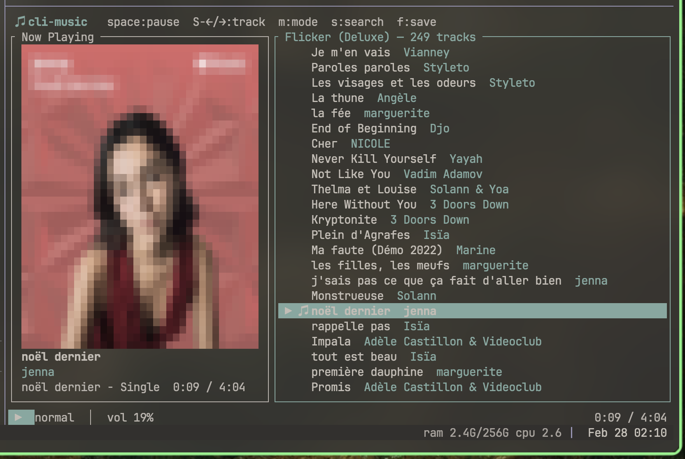

# cli-music

A terminal UI for Apple Music on macOS. Browse your library, control playback, and view album art — all from the terminal.



## Features

- Browse playlists and tracks
- Playback controls (play/pause, seek, next/prev)
- ASCII album art via half-block rendering
- Live search filtering
- Shuffle / repeat mode cycling
- Save tracks to library
- Works in tmux

## Requirements

- macOS with Music.app
- Rust toolchain

## Install

```sh
git clone https://github.com/nooesc/cli-music.git
cd cli-music
cargo build --release
./target/release/cli-music
```

## Keybindings

| Key | Action |
|-----|--------|
| `space` | Play / Pause |
| `Shift+Left/Right` | Previous / Next track |
| `,` / `.` | Seek backward / forward 5s |
| `Up/Down` or `j/k` | Navigate list |
| `Shift+Up/Down` or `J/K` | Jump 5 items |
| `Right` or `Enter` | Open playlist / Play track |
| `Left` or `Esc` | Go back |
| `s` or `/` | Search / filter (press again to clear) |
| `m` | Cycle mode: normal > shuffle > repeat all > repeat one |
| `f` | Save current track to library |
| `+/-` | Volume up / down (Shift for ±20) |
| `n` | Toggle mini-player mode |
| `Tab` or `1/2` | Switch panels |
| `q` | Quit |
